# Frontend AI UX Patterns

**Module 5 — Governed AI Feature Delivery**

---

## The problem we're solving

Chat-style output alone is often unclear and hard to verify.

- Unclear confidence and uncertainty
- Weak evidence visibility
- Poor review workflow for structured data
- Risky direct action on unverified output

Now: build structured, reviewable AI UX patterns.

---

## Why this matters in product delivery

- Users act on what the UI communicates, not on backend intent.
- Unsafe UX can bypass otherwise strong backend controls.
- Trust comes from clarity, not from polished visual design alone.
- Frontend standards are needed for consistency across teams and features.

The frontend is a control layer. Design it like one.

---

## UI patterns that work

- Structured result cards over raw text blocks
- Confidence and evidence cues shown in context
- Editable review step before commit
- Streaming states with clear progression

---

## Chat-first vs task-first UX

| Approach | Strength | Risk |
| -------- | -------- | ---- |
| Chat-first UI | Fast prototyping | Weak structure, poor verification |
| Task-first structured UI | Clear review and control | More upfront design effort |

For governed features, task-first usually wins.
The design effort pays back in auditability and user confidence.

---

## Structured output presentation

- Display typed fields, not paragraphs of generated text.
- Separate extracted data from explanatory or supporting notes.
- Show status per field: accepted, uncertain, or missing.
- Keep the frontend response shape aligned to the backend contract.

---

>If the UI contract diverges from the backend contract, both become harder to govern.

---

## Confidence and uncertainty design

- Confidence is a signal, not a guarantee.
- Use bands (high / medium / low) with explicit, documented meaning.
- Highlight uncertain fields so reviewers know where to focus.
- Do not hide ambiguity to make the UI look cleaner.

Hiding uncertainty does not remove it. It just removes the reviewer's ability to act on it.

---

## Evidence and explanation patterns

- Show a supporting source snippet or reference where possible.
- Provide concise "why this result" text for key fields.
- Link to trace id or audit detail for users who need it.
- Do not expose internal prompt text or policy internals.

---

## Review-before-commit flow

1. Render model output in an editable structured form.
2. Highlight uncertain or policy-sensitive fields clearly.
3. Require explicit confirmation before any high-impact action.
4. Persist the reviewed state and decision metadata for audit.

The user's confirmation is part of the audit trail, not just the UX.

---

## Redaction and safe display

- Mask sensitive fields by default where required by policy.
- Control field visibility by role and permission level.
- Prevent accidental copy or export of protected data.
- Apply redaction behaviour consistently across all components, not per screen.

---

## Streaming UX with SSE

- Use deterministic state stages: queued, processing, partial, complete.
- Render partial updates without layout shift.
- Handle stream interruption with a clear fallback state.
- Never present partial output as final output.

---

## State model for reliable UX

---

---

>Every state must have a defined user action. Undefined states become support tickets.

---

## What to avoid

- One-click actions on unreviewed model output
- A single confidence number with no context or band definition
- Inconsistent fallback behaviour between screens
- UI state contracts that diverge from backend response statuses

---

## UX test scenarios

1. High confidence output with valid supporting evidence.
2. Low confidence on one critical field requiring review.
3. Policy-blocked field requiring redaction before display.
4. Interrupted SSE stream at partial completion.
5. Fallback response from backend returning <code>needs_review</code>.

---

## Module 5 lab build target

Build a TanStack component that:

- Displays structured extraction output with field-level status
- Shows confidence bands and supporting evidence
- Supports an edit-before-save review flow
- Handles streaming states and fallback states explicitly
- Applies safe display and redaction where policy requires it

Definition of done: every UI state from the state model has a defined, tested rendering path.

---

## Summary

1. **UX is part of governance**: it shapes what decisions users make and how.
2. **Structured UI beats generic chat** for production workflows that require verification.
3. **Uncertainty must be visible** and designed to be acted on, not hidden.
4. **State discipline** is essential for streaming, fallback, and audit reliability.

---

## Bridge to Module 6

**What we have now:**

- A governed frontend that makes AI output reviewable and auditable.

**What is next:**

- Good UX needs measurable quality behind it to be trustworthy over time.
- Your first task in Module 6: define what "correct" looks like for your extraction feature using a golden dataset.

Module 6 covers evaluation and quality assurance: repeatable test sets, pass/fail criteria, and prompt comparison.

---

# Questions?

*Module 5 — Governed AI Feature Delivery*