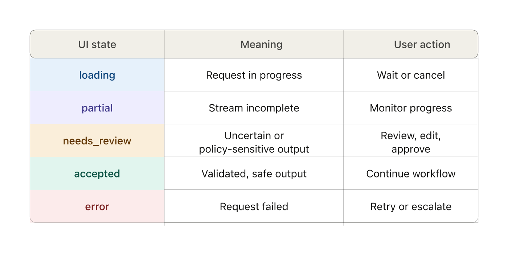
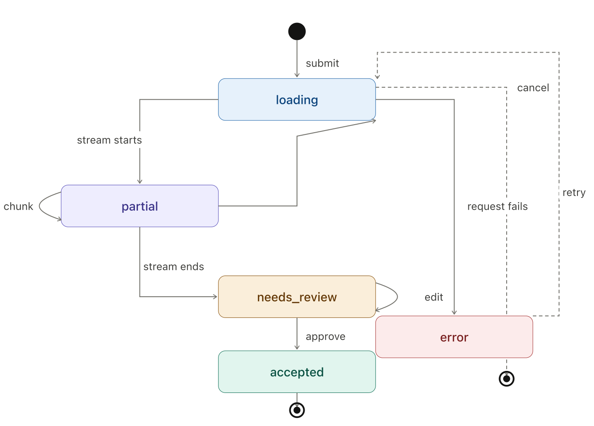

## Opening scenario

Backend returns `needs_review` with reason `policy_sensitive_output`.

The UI shows a green checkmark and the raw model summary.

**Think:** is that a backend bug, a frontend bug, or a governance gap?

<!-- end_slide -->

## Where we left off

Your backend now produces three clearly-distinguished outcomes:

- `accepted` — output passed all checks, ready for display
- `needs_review` — uncertain or policy-sensitive, requires human action
- `denied` — hostile input or policy breach, should not proceed

<!-- pause -->

**Think:** for each of those three outcomes — what should a user see? What should they be able to do?

<!-- speaker_note: 60 seconds - write it down before we look at the app. -->

<!-- end_slide -->

## The frontend is a control layer

Users act on what the UI communicates — not on backend intent.

<!-- pause -->

A strong backend with a weak frontend is still a governance failure.

<!-- pause -->

- A `needs_review` response is only useful if the UI makes the next step obvious.
- A `denied` response is only acceptable if the user understands why.
- An `accepted` response with no confidence signal puts all trust in the model.

<!-- pause -->

> The frontend doesn't just display results. It shapes the decisions users make about them.

<!-- end_slide -->

## State model and machine

<!-- column_layout: [3, 2] -->

<!-- column: 0 -->

Backend outcomes: `accepted`, `needs_review`, `denied`

UI also needs: `idle`, `loading`, `error`, `partial`

> Undefined states become support tickets.

<!-- column: 1 -->



<!-- reset_layout -->

<!-- column_layout: [3, 2] -->

<!-- column: 0 -->

Every transition should be observable — the telemetry panel is your audit affordance.

<!-- column: 1 -->



<!-- reset_layout -->

<!-- end_slide -->

## State model walkthrough

<!--
speaker_note: |
  Open the frontend app. Point at the transition telemetry panel.
  Submit a request and watch idle → loading → accepted.
  Then ask the audit question below.
-->

> "The telemetry panel records every state change with a timestamp. Where does that data go in a production system — and why does it matter for audit?"

<!-- pause -->

**Think:** would a chat interface produce this kind of traceable state record? What would you lose?

<!-- speaker_note: Pair activity - 90 seconds. -->

<!-- end_slide -->

## Demo: the accepted path

**Demo:** Load "Pass sample: invoice" — show the accepted result panel.

<!--
speaker_note: |
  Points to land:
  - Typed fields — not a paragraph of generated text
  - Confidence shown as a raw number — pause here
  - Trace ID visible — provenance in the UI
  - No one-click action — result displayed, not committed
-->

<!-- pause -->

**Ask:** `0.95` — is that enough for a reviewer to act on? What about `0.87`? What about `0.80`?

<!-- pause -->

Confidence needs bands with documented meaning — not a raw float. `0.95` should read *"high: proceed with standard review"*, not just `0.95`.

<!-- pause -->

> Hiding uncertainty does not remove it. It removes the reviewer's ability to act on it.

<!-- end_slide -->

## Demo: the needs_review path

**Demo:** Load "Fail sample: policy review" — show the needs_review panel.

<!--
speaker_note: |
  Points to land:
  - Reason code shown — policy_blocked, not a generic error
  - Three reviewer actions: Approve, Edit, Escalate
  - Reviewer notes and edited summary — part of the record
  - Review events panel shows persisted audit events after action
-->

<!-- pause -->

**Ask:** the reviewer's approval is persisted as a `ReviewDecisionEvent` with an `auditId` and `actorId`.

What evidence does a reviewer actually have here to make a defensible approve/edit/escalate decision? What's missing?

<!-- speaker_note: Pair activity - 90 seconds. -->

<!-- pause -->

> The user's confirmation is part of the audit trail, not just the UX.

<!-- end_slide -->

## Demo: the denied path

**Demo:** Load "Fail sample: deny" — show the denied panel (no sensitive content echoed).

<!--
speaker_note: |
  Points to land:
  - No model call was made — denial happened pre-call
  - Reason shown, sensitive content not echoed back
  - No reviewer actions — denial is final at this boundary
  - Same envelope shape as needs_review — consistent contract
-->

<!-- pause -->

**Think:** should the deny reason be shown to the end user, or only to an admin reviewer?

<!-- speaker_note: Pair activity - 90 seconds - what changes in each case, and for whom? -->

<!-- end_slide -->

## The UI contract must match the backend contract

The app defines `UiState` as:

```typescript
type UiState = "idle" | "loading" | "partial"
             | "accepted" | "needs_review" | "denied" | "error";
```

<!-- pause -->

`accepted`, `needs_review`, and `denied` map directly to `WorkflowResponse.status`.

`idle`, `loading`, `partial`, and `error` are frontend-only lifecycle states.

<!-- pause -->

> If the UI contract diverges from the backend contract, both become harder to govern and harder to test.

<!-- pause -->

When the backend adds a new status — the frontend must handle it explicitly, not default to a generic error state.

<!-- end_slide -->

## Before you call it production-ready

Five checks — work through them for the current UI:

<!-- pause -->

1. High confidence output — does approval feel appropriately deliberate, or one-click?
<!-- pause -->
2. Low confidence field — is the *field* highlighted, not just the overall score?
<!-- pause -->
3. `needs_review` reason — is it actionable, or just visible?
<!-- pause -->
4. `denied` — is the reason shown without echoing sensitive content?
<!-- pause -->
5. Request error — is the state recoverable? Does it preserve what the user typed?

<!-- pause -->

**Think:** which of these does the current app fail?

<!-- end_slide -->

## Summary

<!-- incremental_lists: true -->

- **The frontend is a control layer** — it shapes decisions, not just displays results.
<!-- pause -->
- **State discipline is governance** — every state needs a defined representation and actions.
<!-- pause -->
- **Uncertainty must be visible** — designed to be acted on, not smoothed over.
<!-- pause -->
- **The review step is an audit control** — the user's confirmation is part of the record.
<!-- pause -->
- **UI contract and backend contract must stay aligned** — divergence makes both harder to govern.

<!-- incremental_lists: false -->

<!-- end_slide -->

## Bridge to Module 6

**What you now have:**

A governed frontend that makes AI output reviewable, auditable, and safely displayed.

<!-- pause -->

**The question Module 6 asks:**

Good UX needs measurable quality behind it to be trustworthy over time.

<!-- pause -->

- How do you know the extraction is actually correct — not just structurally valid?
<!-- pause -->
- How do you detect when a prompt change degrades quality before it reaches users?
<!-- pause -->
- What does "good enough to ship" mean in measurable terms?

<!-- pause -->

<!-- speaker_note: Your first task in Module 6 - define what "correct" looks like for your extraction feature using a golden dataset. -->

<!-- end_slide -->

<!-- jump_to_middle -->

Questions?
===

<!-- end_slide -->
